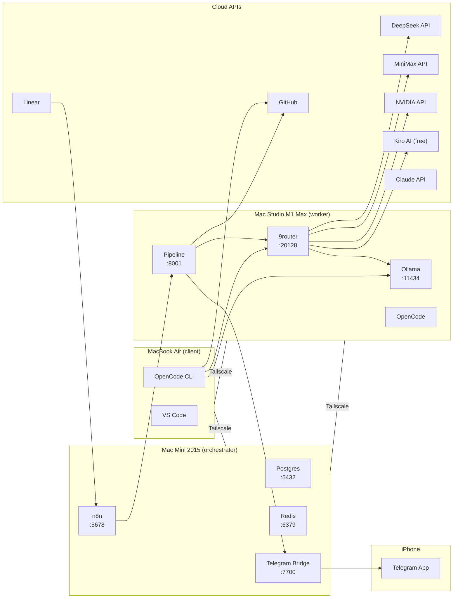

# Architecture & Network Flow

**Stack:** Linear → n8n → Pipeline (CrewAI) → 9router → Providers → GitHub PR
**Hosts:** Mac Mini 2015 (orchestrator), Mac Studio M1 Max (worker), MacBook Air M1 (client)
**Network:** Tailscale Mesh VPN — zero public ports

## 1. Node topology

| Node | Role | Hardware | Always on | Services |
|---|---|---|---|---|
| **Mac Mini** | Orchestrator | Intel i7, 16 GB | Yes | Docker: postgres, redis, n8n, telegram-bridge |
| **Mac Studio** | Worker | M1 Max, 64 GB | Yes | Ollama (brew), Docker: pipeline, opencode, **9router** |
| **MacBook Air** | Client | M1, 8 GB | On-demand | OpenCode CLI, VS Code, git |
| **iPhone** | Remote control | — | Yes | Telegram app |

## 2. Trust zones

| Zone | Members | Reachability |
|---|---|---|
| **Mesh** | All 3 Macs via Tailscale | `100.x.x.x` (Tailscale IPs only) |
| **Loopback** | Docker containers on Mini/Studio | Localhost only |
| **Cloud** | DeepSeek, MiniMax, Claude, GitHub APIs | Outbound HTTPS only |

**Zero public ports.** No reverse proxy, no Cloudflare Tunnel, no open firewall rules. All inter-node communication is over Tailscale Mesh.

## 3. Flow diagram



## 4. 9router & LLM fallback chain

**9router** (port 20128) provides:
- Token compression (RTK) - saves 20-40%
- Auto-fallback: Subscription → Cheap → Free
- Real-time quota tracking
- Dashboard for provider management

```
Pipeline → 9router → Kiro AI (free, unlimited)
              → MiniMax M2.7 ($0.2/1M)
              → NVIDIA Nemotron ($1.5/1M)
              → DeepSeek V4 ($0.14/1M)
              → Studio Ollama (local, free)
```

## 5. Self-healing properties

| Layer | Mechanism | Recovery time |
|---|---|---|
| Docker containers | `restart: unless-stopped` | < 5 s |
| Ollama | `brew services start ollama` | < 10 s |
| 9router | `docker compose up -d 9router` | < 10 s |
| Tailscale mesh | macOS managed extension | < 10 s |
| Power failure | `sudo pmset -a autorestart 1` | < 60 s |
| Git push failure | Pipeline retries up to 3 times | Per attempt |

# Mac Mini Machine Context

> Auto-generated setup snapshot. Update after any configuration changes.

## Identity

| Field | Value |
|---|---|
| Hostname | Nhan's Mac Mini |
| macOS | 12 (Monterey) |
| Node type | `mini` (orchestrator) |
| Tailscale IP | `100.87.151.9` |
| Tailscale hostname | `mini2015` |
| Tailnet | `zhinnyshop` |

## Docker Services (compose/mini.yml)

All services bind to Tailscale IP only (no public ports).

| Service | Image | Port | Status |
|---|---|---|---|
| postgres | pgvector/pg16:16 | 5432 | healthy |
| redis | redis:7-alpine | 6379 | healthy |
| n8n | n8nio/n8n:latest | 5678 | ready |
| telegram-bridge | custom build | 7700 | polling mode |
| LLM router | 9router (docker) | 20128 | active |
| grafana | grafana/grafana:latest | 3000 | up |
| prometheus | prom/prometheus:latest | 9090 | up |
| iphone-pwa | custom build | 8080 | up |

## Pipeline (compose/studio.yml)

| Field | Value |
|---|---|
| Process | `python pipeline.py --dispatcher --port 8001` |
| Port | 8001 |
| Workers | **3 parallel workers** (worker, worker-2, worker-3) |
| LLM | NVIDIA Llama 3.1 via opencode (with MiniMax fallback) |
| Models | `nvidia/meta/llama-3.1-70b-instruct` (primary), `minimax-coding-plan/MiniMax-M2.7` (fallback) |
| Telegram Host | `MINI_SERVER_IP` (100.117.146.122) — pipeline notifies via this Mac Mini |

## Opencode Container

| Field | Value |
|---|---|
| Container | `devstation-studio-opencode-1` |
| Port | 4096 |
| Auth | From `.env` via NVIDIA_API_KEY and MINIMAX_API_KEY |

## Telegram

| Field | Value |
|---|---|
| Bot polling | active (no public URL needed) |
| Chat ID | configured |
| Notify endpoint | `POST :7700/notify {message: string}` |
| Commands | `/status`, `/pause`, `/resume`, `/approve`, `/reject`, `/llm`, `/help` |

## Network

| Service | Internal URL | External URL |
|---|---|---|
| n8n | http://127.0.0.1:5678 | http://100.87.151.9:5678 |
| Pipeline | http://127.0.0.1:8001 | http://100.87.151.9:8001 |
| Telegram bridge | http://127.0.0.1:7700 | http://100.117.146.122:7700 (MINI_SERVER_IP) |
| Light Router | http://127.0.0.1:4000 | http://100.87.151.9:4000 |
| Grafana | http://127.0.0.1:3000 | http://100.87.151.9:3000 |
| Prometheus | http://127.0.0.1:9090 | http://100.87.151.9:9090 |
| PWA | http://127.0.0.1:8080 | http://100.87.151.9:8080 |

## Known Config

- **Tailscale CLI**: Wrapper at `/usr/local/bin/tailscale` → `/Applications/Tailscale.app/Contents/MacOS/Tailscale` (brew formula NOT used — builds from source, very slow)
- **Docker Desktop**: Headless mode (`openUIOnStartupDisabled: true`), 2GB RAM, 2 CPUs, no K8s
- **Python venv for pipeline**: `/tmp/pipeline-venv` (created by setup script)
- **n8n encryption key**: Generated at setup, stored in `.env` (do not lose)
- **Postgres password**: Generated at setup, stored in `.env` (do not lose)
- **DEEPSEEK_MODEL**: `deepseek-chat` (set in `.env`)
- **Pipeline workspace**: `/tmp/devstation-workspace` (set via `WORKSPACE_DIR` in `.env`)
- **MINI_SERVER_IP**: `100.117.146.122` — Mac Mini Tailscale IP for Telegram bridge notifications

## Workflow Integration

```
Linear issue (tag: "plan" / "implement")
  → n8n Trigger (webhook)
  → POST :8001/webhook
  → Pipeline (6 agents, cloud LLMs)
  → GitHub PR
  → Telegram notification
```

## CLI Commands

```bash
./bin/devstation.sh setup       # One-command setup
./bin/devstation.sh status      # Check services
./bin/devstation.sh doctor      # Diagnostics
./bin/devstation.sh down        # Stop all
./bin/devstation.sh restart     # Restart all
```

## Troubleshooting

| Symptom | Fix |
|---|---|
| n8n "Mismatching encryption keys" | Delete n8n volume and recreate: `docker volume rm devstation-mini_n8n_data && docker compose up -d n8n` |
| Postgres auth failures | Delete db volume: `docker volume rm devstation-mini_pg_data && docker compose up -d postgres` |
| Port binding errors | Check Tailscale is connected: `tailscale status` |
| Pipeline not starting | Check `.run/pipeline.log`, run: `/usr/local/bin/devstation-pipeline` |
| light-router not starting | No longer used - replaced by 9router on Studio |
| Pipeline "All LLM providers failed" | Check `.env` has `DEEPSEEK_API_KEY` set and `DEEPSEEK_MODEL=deepseek-chat` |
| Pipeline "Invalid format specifier" | Check for unescaped `{}` in f-strings inside `pipeline.py` agent prompt templates |
| 9router not starting | Check credentials at dashboard or rebuild: `docker compose -f compose/studio.yml up -d --build 9router` |
| Telegram not sending messages | Pipeline now uses `MINI_SERVER_IP` (100.117.146.122) — ensure `.env` has `MINI_SERVER_IP=100.117.146.122` |
| Only 1 or 2 workers running | Run: `docker compose -f compose/studio.yml up -d worker worker-2 worker-3` |

## Setup Session Log (May 2, 2026)

### Bugs Fixed
1. **devstation.sh `parse_args()`**: Last line `[ -z "$ACTION" ] && ...` returned non-zero with `set -e`, causing immediate exit. Fix: appended `; true`.
2. **devstation.sh `run()` function**: Used `eval "$*"` which broke with spaces/special chars. Fix: replaced with `"$@"`.
3. **Pipeline f-string format bug**: Unescaped `{` in agent `agent_pm` prompt caused `Invalid format specifier`. Fix: escaped inner braces as `v-pre: { { ... } }`.
4. **Pipeline workspace**: Default `/Volumes/work` didn't exist. Fix: set `WORKSPACE_DIR=/tmp/devstation-workspace`.

### Issues Resolved
1. **Telegram CHAT_ID**: Was wrong (`8774371348` → `1121576537`), causing 403 Forbidden.
2. **n8n Linear Trigger**: IF node `array contains` operator incompatible with n8n version. Replaced with Code node.
3. **LiteLLM crash**: `ghcr.io/berriai/litellm:main-stable` had upstream breaking changes (routing strategy renamed, Prisma P1012 on Wolfi Linux). Replaced with custom `light-router` (60-line Python proxy, 3.71 GB freed).

### Pipeline Test
- PR #20 created successfully: https://github.com/thanhnhan2tn/mini-dev-station/pull/20
- Full flow: webhook → DeepSeek LLM → spec generation → git clone → branch → PR ✓

### Files Changed
- `bin/devstation.sh`: Fixed `run()` and `parse_args()` bugs
- `compose/mini.yml`: Replaced `ai-router` (litellm) with `light-router`; added n8n env vars
- `ai-router/config.yaml`: Fixed `routing_strategy: usage-based` → `usage-based-routing` (then replaced entirely)
- `pipeline.py`: Fixed f-string format bug, added `_safe_json_parse()`, pre-computed `files_md`/`code_files_md`
- `projects.yaml`: Hardcoded `github_repo` instead of env var with default
- `.env`: Added `DEEPSEEK_MODEL=deepseek-chat`, `WORKSPACE_DIR`, fixed `TELEGRAM_CHAT_ID`
- `light-router/proxy.py`: Created (new)
- `light-router/Dockerfile`: Created (new)
- `telegram-bridge/bot.py`: Added polling loop (was webhook-only)
- `bin/pipeline-wrapper.sh`: Fixed env loading (`export $(grep ...)` → `set -a; source .env; set +a`)
- `linear-pipeline/linear_to_opencode.json`: Replaced IF node with Code node, hardcoded URLs


