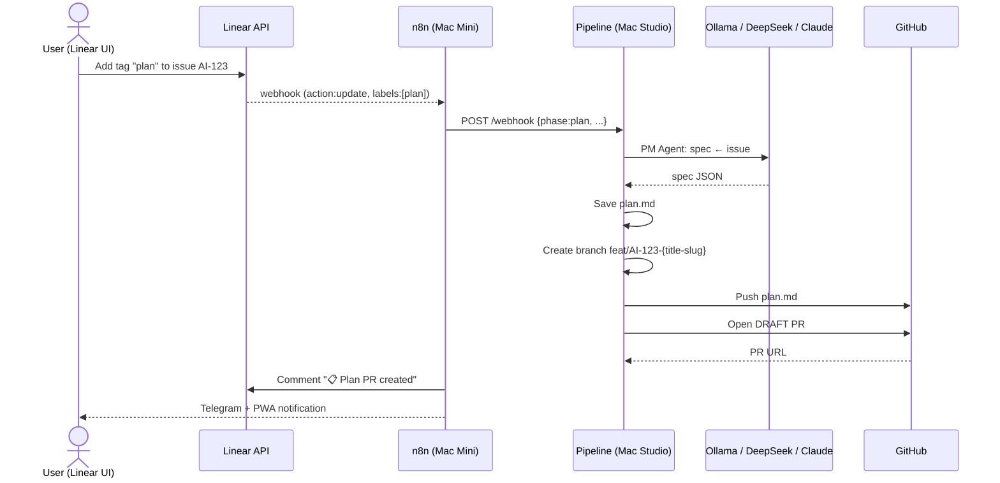
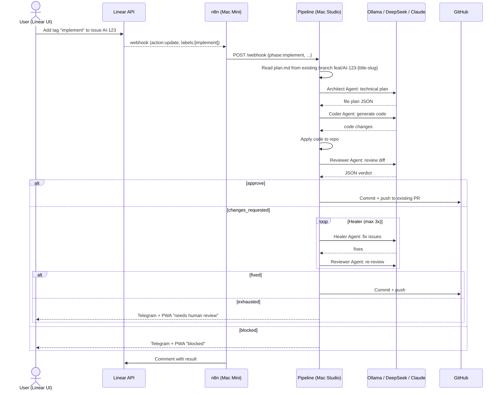

# Automated Workflow — Linear Issue → Pull Request

## Architecture Overview

```
┌──────────┐     ┌──────────┐     ┌────────────────────┐
│  Linear  │────▶│   n8n   │────▶│   Pipeline.py     │
│  Issues  │     │ Webhook │     │ (Docker/Studio)   │
└──────────┘     └──────────┘     └────────────────────┘
                                             │
                                             ▼
                                    ┌────────────────────┐
                                    │ 6-Agent Chain     │
                                    │ PM → Architect → │
                                    │ Coder → Reviewer→ │
                                    │ Healer → Release │
                                    └────────────────────┘
                                             │
                                             ▼
                                    ┌────────────────────┐
                                    │  opencode  │
                                    │ (All Providers)  │
                                    └────────────────────┘
```

## 1. Supported LLM Providers (via 9router)

All LLM calls route through **9router** (port 20128) for unified API proxy with centralized key management:

```
opencode (docker exec) → 9router → provider APIs (NVIDIA, MiniMax, DeepSeek, Claude)
```

### How the 6 agents pick LLM providers

The pipeline.py `TIER_MODEL` maps each agent to a provider. When opencode runs, it uses the model name to route through 9router, which then forwards to the actual provider.

| Provider | Model (for opencode) | Provider API | Cost/1M tokens |
|---|---|---|---|
| **NVIDIA** | `nvidia/meta/llama-3.1-70b-instruct` | NVIDIA NIM | ~$0.40 |
| **MiniMax** | `minimax-coding-plan/MiniMax-M2.7` | MiniMax API | ~$0.30 |
| **DeepSeek** | `deepseek/deepseek-chat` | DeepSeek API | ~$0.14 |
| **OpenAI** | `github-copilot/gpt-4o` | OpenAI API | ~$2.50 |
| **Claude** | `github-copilot/claude-sonnet-4.5` | Anthropic API | ~$3.00 |

### opencode auth.json configuration

opencode container uses `*_api_base` keys to route all calls through 9router:

```json
{
  "nvidia": {"type": "api", "key": "${NVIDIA_API_KEY}"},
  "minimax-coding-plan": {"type": "api", "key": "${MINIMAX_API_KEY}"},
  "deepseek": {"type": "api", "key": "${DEEPSEEK_API_KEY}"},
  "claude-premium": {"type": "api", "key": "${CLAUDE_API_KEY}"},
  "minimax_api_base": "http://devstation-studio-9router-1:20128/v1"
}
```

### Fallback Chain (within 9router)

When a provider fails, 9router handles failover:

| Primary | Falls back to |
|---|---|
| nvidia | minimax → deepseek → error |
| minimax | nvidia → deepseek → error |
| deepseek | nvidia → minimax → error |
| claude-premium | nvidia → minimax → error |

### Tier routing (pipeline.py TIER_MODEL)

| Tier | PM | Architect | Coder | Reviewer | Healer |
|---|---|---|---|---|---|---|
| **Simple** | nvidia | nvidia | nvidia | nvidia | nvidia |
| **Medium** | nvidia | nvidia | nvidia | nvidia | nvidia |
| **Complex** | nvidia | nvidia | nvidia | nvidia | nvidia |
| **Premium** | claude-premium | claude-premium | claude-premium | claude-premium | claude-premium |

### Cost estimate (monthly, 60 tasks)

| Tier | Tasks | Provider | Cost/task | Monthly |
|---|---|---|---|---|
| Simple | 24 | NVIDIA | ~$0.01 | ~$0.24 |
| Medium | 24 | NVIDIA | ~$0.02 | ~$0.48 |
| Complex | 12 | NVIDIA | ~$0.05 | ~$0.60 |
| Premium | ~5 | Claude | ~$0.30 | ~$1.50 |
| **Total** | ~65 | | | **~$2.82** |

Claude Premium only activates when you tag an issue with `premium` or `claude`.

---

## 2. Hybrid Devin-Station Workflow (NHA-21)

For complex tasks, you can use **Devin** for architectural planning and the **Local Station** for implementation.

1. **Plan Phase (Devin)**:
   - Add the `!plan` label to a Linear issue.
   - Devin analyzes the task and posts a plan as a comment and in `docs/plans/`.
2. **Implement Phase (Local)**:
   - Add the `implement` label to the Linear issue.
   - Local pipeline reads Devin's plan and executes the Coder/Reviewer/Healer chain.

## 3. Tag-Based Two-Phase Trigger

```
Linear Issue created/updated with tag "plan" or "implement"
  → n8n webhook → POST /webhook to pipeline.py (Mac Studio)
  → projects.yaml lookup (team_id → repo, base_branch, trigger_labels)
  → complexity gate → Execute phase based on tag
```

## 2. Phase: Plan (tag: "plan")



## 3. Phase: Implement (tag: "implement")



## 4. 6-Agent Chain

| Agent | Role | Input | Output | Default Provider |
|---|---|---|---|---|
| **PM** | Spec generation | Issue title + body | JSON: spec, acceptance_criteria, files, risk | Ollama (simple) / DeepSeek (medium+) |
| **Architect** | Technical planning | Spec + plan.md | JSON: file_plan, invariants, test_plan | Ollama / DeepSeek / o3-mini / Claude |
| **Coder** | Code generation | Plan | JSON: file contents + commands | Ollama / DeepSeek / o3-mini / Claude |
| **Reviewer** | Code review | Git diff | JSON: overall, issues, summary | Ollama / DeepSeek / o3-mini / Claude |
| **Healer** | Auto-fix | Diff + review issues | JSON: fixed files | Ollama / DeepSeek |
| **Release** | PR management | Branch, title, body | PR URL | Ollama / DeepSeek |

## 5. Multi-Repo Configuration

Edit `projects.yaml` to map Linear teams to GitHub repos:

```yaml
projects:
  healthtech:
    linear_team_id: "TEAM_UUID_1"
    github_repo: "org/healthtech"
    trigger_labels:
      plan: "plan"
      implement: "implement"
```

## 6. Cost Control

### Branch Naming Convention

All Git branches use the format `feat/<issue-id>-<title-slug>`:
- Example: `feat/AI-123-fix-login-oauth`
- Slug is max 30 characters, lowercase, spaces replaced with dashes
- Slug is generated from the issue title using `slugify()` function in `pipeline.py`

```python
def slugify(text: str, max_len: int = 40) -> str:
    text = text.lower()
    text = re.sub(r'[^a-z0-9]+', '-', text)
    text = re.sub(r'^-|-$', '', text)
    return text[:max_len]
```

This makes branches human-readable while remaining valid Git branch names.

| Tier | Cloud Cost/Task | Monthly (60 tasks) |
|---|---|---|
| Simple (24 tasks) | $0 | $0 |
| Medium (24 tasks) | ~$0.01 | ~$0.24 |
| Complex (12 tasks) | ~$0.08 | ~$0.96 |
| Classification overhead | ~$0.001 | ~$0.06 |
| **Total** | | **~$1.26** |

Claude Premium only activates when you tag an issue with `premium` or `claude`.
At ~$0.30/task, using it for 5 tasks/month adds ~$1.50 — still well under $20.

## 7. Error Handling

| Failure | Retry | Escalation |
|---|---|---|
| LLM timeout | Tier-aware fallback chain | Telegram notify |
| Review blocked | — | Stop, notify human |
| Review changes_requested | Healer agent (max 3) | Human review via Telegram/PWA |
| Git push conflict | Rebase + retry | Telegram notify |
| All providers down | — | Grafana alert + Telegram |
