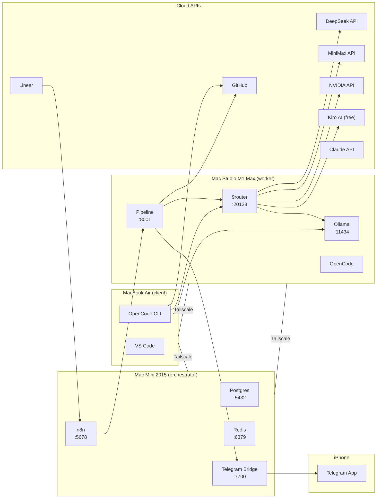

# Architecture & Network Flow

**Stack:** Linear → n8n → Pipeline (CrewAI) → 9router → Providers → GitHub PR
**Hosts:** Mac Mini 2015 (orchestrator), Mac Studio M1 Max (worker), MacBook Air M1 (client)
**Network:** Tailscale Mesh VPN — zero public ports

## 1. Node topology

| Node | Role | Hardware | Always on | Services |
|---|---|---|---|---|
| **Mac Mini** | Orchestrator | Intel i7, 16 GB | Yes | Docker: postgres, redis, n8n, telegram-bridge |
| **Mac Studio** | Worker | M1 Max, 64 GB | Yes | Ollama (brew), Docker: pipeline, opencode, **9router** |
| **MacBook Air** | Client | M1, 8 GB | On-demand | OpenCode CLI, VS Code, git |
| **iPhone** | Remote control | — | Yes | Telegram app |

## 2. Trust zones

| Zone | Members | Reachability |
|---|---|---|
| **Mesh** | All 3 Macs via Tailscale | `100.x.x.x` (Tailscale IPs only) |
| **Loopback** | Docker containers on Mini/Studio | Localhost only |
| **Cloud** | DeepSeek, MiniMax, Claude, GitHub APIs | Outbound HTTPS only |

**Zero public ports.** No reverse proxy, no Cloudflare Tunnel, no open firewall rules. All inter-node communication is over Tailscale Mesh.

## 3. Flow diagram



## 4. 9router & LLM fallback chain

**9router** (port 20128) provides:
- Token compression (RTK) - saves 20-40%
- Auto-fallback: Subscription → Cheap → Free
- Real-time quota tracking
- Dashboard for provider management

```
Pipeline → 9router → Kiro AI (free, unlimited)
              → MiniMax M2.7 ($0.2/1M)
              → NVIDIA Nemotron ($1.5/1M)
              → DeepSeek V4 ($0.14/1M)
              → Studio Ollama (local, free)
```

## 5. Self-healing properties

| Layer | Mechanism | Recovery time |
|---|---|---|
| Docker containers | `restart: unless-stopped` | < 5 s |
| Ollama | `brew services start ollama` | < 10 s |
| 9router | `docker compose up -d 9router` | < 10 s |
| Tailscale mesh | macOS managed extension | < 10 s |
| Power failure | `sudo pmset -a autorestart 1` | < 60 s |
| Git push failure | Pipeline retries up to 3 times | Per attempt |